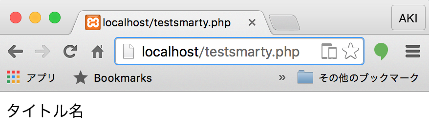

# smarty

```text
lampp
├── htdocs
│   └── testsmarty.php
└── php_libs
    ├── smarty
    │   ├── templates
    │   │   └── testsmarty.tpl
    │   ├── templates_c
    │   └── libs
    └── init.php
```

## testsmarty.phpを作成

```php
<?php
define('_ROOT_DIR', __DIR__ . '/');
require_once _ROOT_DIR . '../php_libs/init.php';

$smarty  = new Smarty;
$smarty->template_dir = _SMARTY_TEMPLATES_DIR;
$smarty->compile_dir  = _SMARTY_TEMPLATES_C_DIR;

$smarty->assign("title", "タイトル名");

$file = 'testsmarty.tpl';

$smarty->display($file);
?>
```

## testsmarty.tpl

```php
{$title}
```

### 確認

ブラウザの検索バーに`localhost/testsmarty.php`と入力

以下のような表示が得られれば成功



