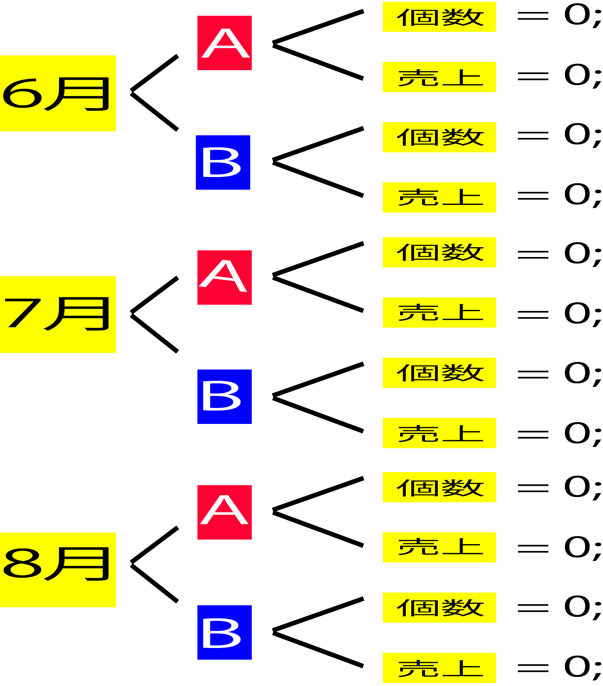
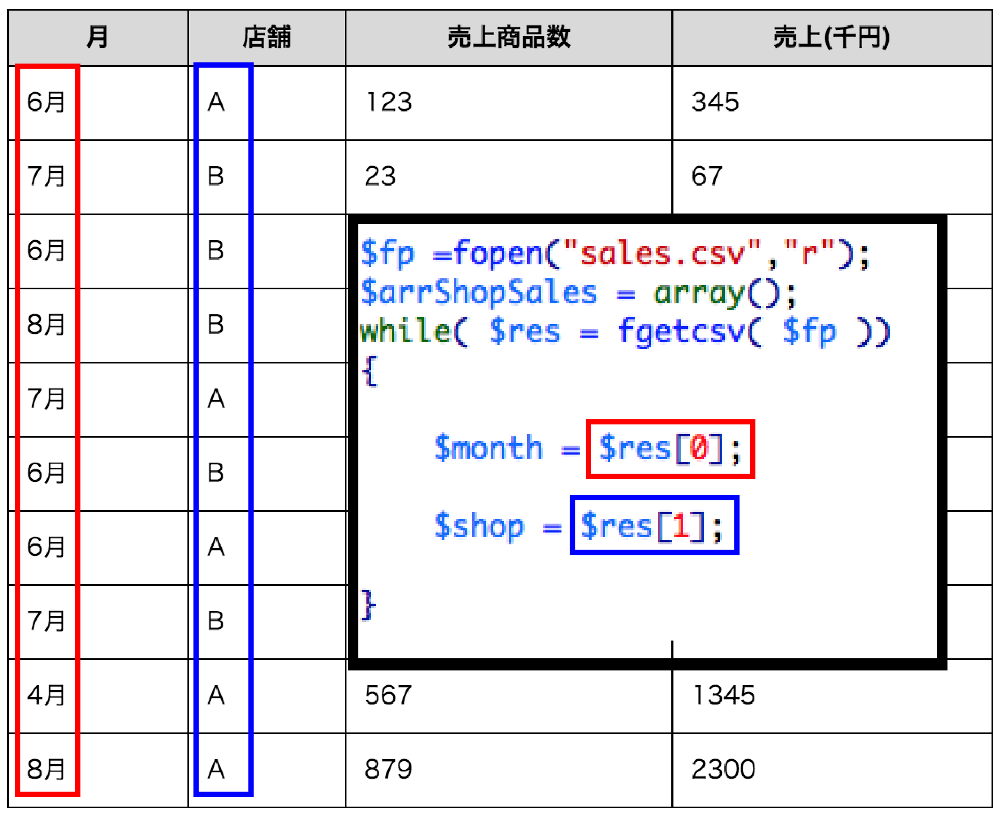
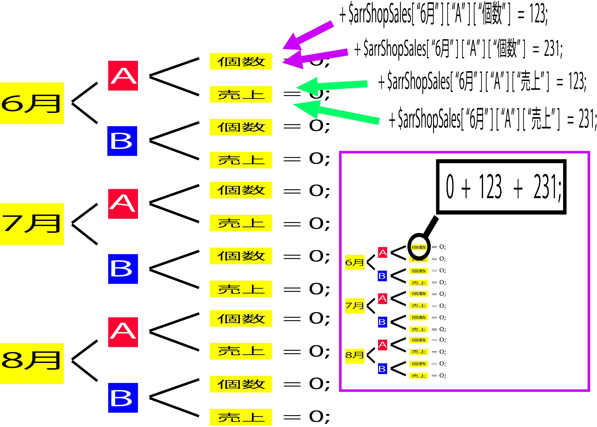
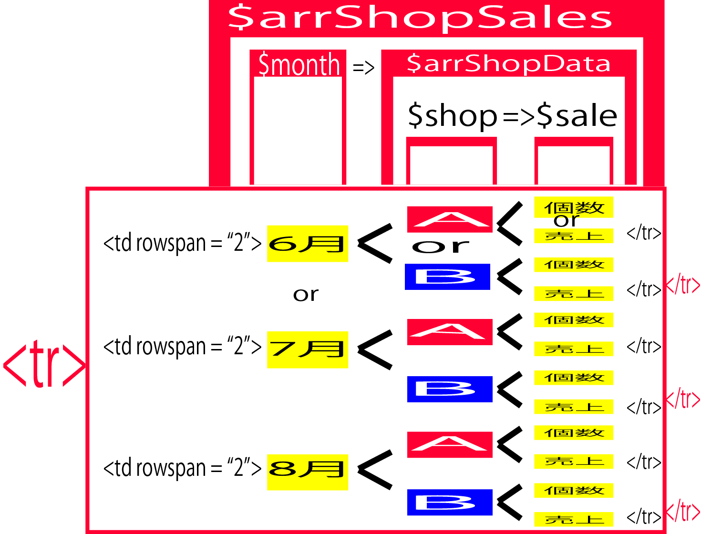

# ２日目小テスト

## 問１
### 問1-1
* 以下のCSVファイルを作り、それを読み込んで、以下のようなテーブル形式で表示してください。

| name | age | pref | belong |
| 松本 | 32</th><td>千葉 | 教育 |
| 中田 | 33</th><td>兵庫 | 経営 |

### 問1-2
* 以下のテーブルをHTMLのみで作成してください。

<table border="1px">
    <tr>
       <th>月</th>
        <th>商品数</th>
        <th>個数</th>
        <th>売上</th>
    </tr>
    <tr>
        <td rowspan="2">6月</td>
        <td>A</td>
        <td>1</td>
        <td>100</td>
    </tr>
    <tr>
        <td>B</td>
        <td>2</td>
        <td>200</td>
    </tr>
    <tr>
        <td rowspan="2">7月</td>
        <td>A</td>
        <td>3</td>
        <td>300</td>
    </tr>
    <tr>
        <td>B</td>
        <td>4</td>
        <td>400</td>
    </tr>
    <tr>
        <td rowspan="2">8月</td>
        <td>A</td>
        <td>5</td>
        <td>500</td>
    </tr>
    <tr>
        <td>B</td>
        <td>6</td>
        <td>600</td>
    </tr>
</table>

### 問1-3

* 以下のテーブルをforeachを使用して作成してみましょう。

<table border=1px>
<tr><td rowspan=2>1</td><td>A</td><td>C</td><td>D</td></tr><td>B</td><td>C</td><td>D</td></tr>
<tr><td rowspan=2>2</td><td>A</td><td>C</td><td>D</td></tr><td>B</td><td>C</td><td>D</td></tr>
</table>

### 問1-4

* 6を「start_month」、8を「last_month」として定義してください。
* "A"と"B"が入った配列「$arrShop」を作成してください。
* "個数"と"売上"が入った配列「$arrCol」を作成してください。

### 問1-5

* for文を使用し、6、7、8が入った配列「$arrMonth」を作成し、「6月 7月 8月」と表示してください。

### 問1-6
* まずは下の図を参照してください。



* $arrShopSalesという多次元配列を作成しましょう。

```text
$arrShopSales[6]["A"]["個数"] 〜 $arrShopSales[8]["B"]["売上"]
```
    
$arrMonth、$arrShop、$arrColを利用してください。

### 問1-7
* sales.csvを読み込みましょう。

### 問1-8
* sales.csvの「月」と「店舗」のみを$monthと$shopをそれぞれ作成してみましょう。



### 問1-9

* インデックス[$month]、[$shop]に対応した多次元配列に値を足していきましょう。



### 問1-10



### 復習
* 1-1から1-10までに行った内容を元に以下の問いを解いてみましょう。
* 以下のCSVファイルを作り、月ごと、店舗ごとに、売上を集計してください。(完成図参照)

| 月 | 店舗 | 個数 | 売上 |
|:----|:----|:----|:----|
| 8月 | B | 435 | 1234</td></tr>
| 6月 | A | 123 | 345</td></tr>
| 7月 | B | 23 | 67</td></tr>
| 6月 | B | 111 | 765</td></tr>
| 7月 | A | 341 | 987</td></tr>
| 6月 | B | 453 | 900</td></tr>
| 6月 | A | 231 | 700</td></tr>
| 7月 | B | 122 | 499</td></tr>
| 7月 | A | 567 | 1345</td></tr>
| 8月 | A | 879 | 2300</td></tr>

<table border="1">
    <tr>
        <td colspan="4">完成図(以下のテーブルを表示してみてください)</td>
    </tr>
    <tr>
        <td>月</td>
        <td>店舗</td>
        <td>売上商品数</td>
        <td>売上(千円)</td>
    </tr>
    <tr>
        <td rowspan="2">6月</td>
        <td>A</td><td>　</td><td>　</td>	<!-- データ1だけ上のtrタグの中に入る -->
    </tr>
    <tr>
        <td>B</td><td>　</td><td>　</td>
    </tr>
    <tr>
        <td rowspan="2">7月</td>
        <td>A</td><td>　</td><td>　</td>	<!-- データ1だけ上のtrタグの中に入る -->
    </tr>
    <tr>
        <td>B</td><td>　</td><td>　</td>
    </tr>
    <tr>
        <td rowspan="2">8月</td>
        <td>A</td><td>　</td><td>　</td>	<!-- データ1だけ上のtrタグの中に入る -->
    </tr>
    <tr>
        <td>B</td><td>　</td><td>　</td>
    </tr>
</table>

## 問２
### 問2-1

２つの変数を用意し、preg_matchを使って、ともに以下のような郵便番号の入力チェックを行ってください。

* zip		3ケタの数字
* zip		4ケタの数字

※条件を満たさない場合は、NGと表示し、２つの変数が共に、条件を満たしていればOKと表示

３つの変数を用意し、preg_matchを使って、共に以下のような電話番号の入力チェックを行ってください。

* tel1	1~6ケタの数字
* tel2	1~6ケタの数字
* tel3	1~6ケタの数字

全体で、11ケタ以内の数字

※全ての条件を満たしていれば、OKと表示し、一つでも条件を満たさなければNG

### 問2-2

* メールアドレスを、正規表現でチェックしてください。メールアドレスの規則は以下の内容とします。
* ※１文字目は英数字。それ以降は、英数字と記号。
    「@」が入る。「@」以降は、「英数字」「ドット」「英数字」で、最低一回は「ドット」が入る。

## 問３
### 問3-1
* 本日授業で学習したform.phpに、「年齢」「郵便番号」「住所」「画像」「備考」という欄を加えてください。
* エラーチェックなどは以下の使用を参考にしてください

| 値 | 未入力 | その他エラーチェック |
|:----|:----|:----|
| 年齢 | 不可 | 数字でなければエラー |
| 郵便番号 | 不可 | ７ケタの数字でなければエラー |
| 住所 | 不可 | 特になし |
| 画像 | 可 | 授業時と同じ |
| 備考 | 可 | 備考 |

### 問3-2
* 3-1で、入力して値をテキストファイルに保存し、画面下部に表示してください。

## 問４
### 大問4
* 別のテキストファイルに「id」「password」を入力しておき、form画面で「id」「pass」を入力させ、両方とも一致すれば「OK！」と表示。
    そうでなければ、「ログイン情報が間違っています」というエラーメッセージを表示してください。

