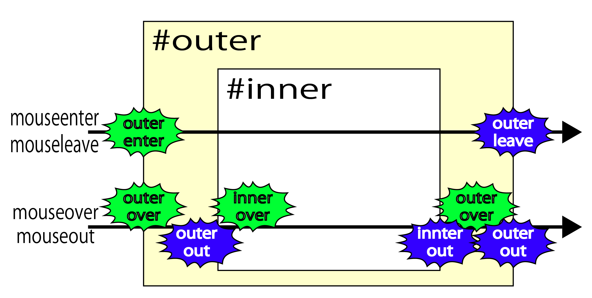
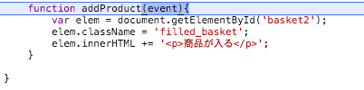
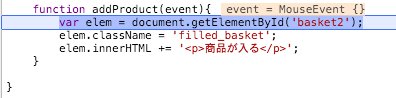
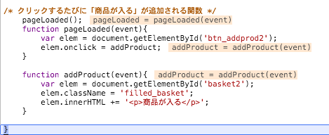
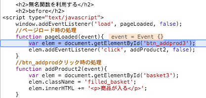

# イベント

## 概要

### イベントとは

* `ユーザーの操作したタイミング`を検出するための仕組み
    * クリックなどの「事件」が発生すると、関連付けておいた関数が呼び出される
    * イベントによって呼び出される関数のことを`イベントハンドラ`、または`イベントリスナー`と呼ぶ
* `ある出来事が起こったタイミング`
    * jQuery(JavaScript)では、ページの内容を変更する流れが一般的。

今回の例では、submitイベントをきっかけの出来事にしている。

* submitイベント
    * フォーム送信のサブミットボタンがクリックされた際にタイミングで発生

```javascript
$('フォームのIDまたはクラス').submit(function(e) {
    〜submitボタンが押されてからの処理
});
```
### イベントドリブンモデル

上記のようにイベントに応じて処理を実行するというプログラムのスタイル

`マウスをクリックした`などの能動的なもの以外に、
`ページが読み込まれた`などもイベントの一種。

例として、書きなどは`ページがロードされたら`というタイミングで処理を行う。

```javascript
$(function(){
	...コード...
});
```

上記は、省略せずに書くと以下の形

```javascript
$(document).ready(function(){
	...コード...
});
```

* `document`
    * ブラウザに表示されているページそのものを表すブラウザ標準のオブジェクト
        * $()関数で囲むことで、ページそのものを表すjQueryオブジェクトを生成できる
* `readyメソッド`
    * ready(=ページの準備ができた)というイベントが発生したタイミングで、指定された処理を実行しなさい、という意味
* `function(){...}`
    * JavaScriptで処理の塊を表す場合の決まり事
    
### 基本文法

```jquery-css
$(セレクター).イベント(function(){
	...イベントが発生した時に実行すべき処理...
});
```

### 利用できるイベント

<table class="filter">
<tr><th>分類</th><th>イベント名</th><th>発生するタイミング</th></tr>
<tr><td rowspan="9">マウス</td><td>click</td><td>要素をクリックした</td></tr>
<tr><td>dbclick</td><td>要素をダブルクリックした</td></tr>
<tr><td>mousedown</td><td>マウスのボタンを押した</td></tr>
<tr><td>mouseenter</td><td>要素にマウスポインターが当たった</td></tr>
<tr><td>mouseleave</td><td>要素からマウスポインターが離れた</td></tr>
<tr><td>mousemove</td><td>要素の中をマウスポインターが移動した</td></tr>
<tr><td>mouseout</td><td>要素からマウスポインターが離れた</td></tr>
<tr><td>mouseover</td><td>要素にマウスポインターが当たった</td></tr>
<tr><td>mouseup</td><td>マウスのボタンを離した</td></tr>
<tr><td rowspan="3">キー</td><td>keydown</td><td>キーを押した</td></tr>
<tr><td>keypress</td><td>キーが押されている</td></tr>
<tr><td>keyup</td><td>キーを離した</td></tr>
<tr><td rowspan="5">フォーム</td><td>blur</td><td>要素からフォーカスが外れた</td></tr>
<tr><td>change</td><td>要素の値を変更した(input、select、textareaなど)</td></tr>
<tr><td>focus</td><td>要素にフォーカスが移った</td></tr>
<tr><td>select</td><td>テキストボックス/テキストエリアのテキストを選択した</td></tr>
<tr><td>submit</td><td>フォームを送信した</td></tr>
<tr><td rowspan="3">その他</td><td>resize</td><td>ウィンドウのサイズを変更した</td></tr>
<tr><td>scroll</td><td>ページや要素をスクロールした</td></tr>
<tr><td>contextmenu</td><td>コンテキストメニューを表示する前</td></tr>
</table>

### HTMLで利用する際のプロパティ

HTMLの中で利用する際には以下のような形

<table>
<tr>
	<th>onblur</th>
</tr>
<tr>
    <td><input type="button" onBlur="alert('blur')"></td>
</tr>

<tr>
    <th>onchange</th>
</tr>
<tr>
    <td>
    <select onChange="alert('onChange')"><br>
    <option value="onChenge" selected="selected">onChange</option>
    <option value="test">test</option>
    </select>
    </td>
</tr>

<tr>
    <th>onclick</th>
</tr>
<tr>
    <td><p onClick="alert('onClick')">クリック</p></td>
</tr>

<tr>
    <th>oncontextmenu</th>
</tr>
<tr>
	<td><div oncontextmenu="alert('ontextmenu')">右クリック</div></td>
</tr>

<tr>
    <th>ondblclick</th>
</tr>
<tr>
	<td>
	<td onDblClick="alert('onDblClick')">ダブル</td>
    </td>
</tr>

<tr>
	<th>onfocus</th>
</tr>
<tr>
	<td>&nbsp;</td>  
</tr>


<tr>
	<th>onkeydown</th>
</tr>
<tr>
	<td>
    	<input type="text" size="10" name="a"
onkeydown="Down();" onkeyup="Up();" onkeypress="Press();"><br>
		<textarea cols="2" rows="1" name="d"></textarea>
	</td>
</tr>

<tr>
    <th>onkeypress</th>
</tr>
<tr>
	<td><textarea cols="2" rows="1" name="p"></textarea></td>
</tr>

<tr>
	<th>onkeyup</th>
</tr>
<tr>
	<td><textarea cols="2" rows="1" name="u"></textarea></td>    
</tr>

<tr>
    <th>onmousedown</th>
</tr>
<tr>
	<td>
	<td onMouseDown="alert('onMouseDown')">マウスダウン</td>
    </td>
</tr>

<tr>
    <th>onmousemove</th>
</tr>
<tr>
	<td>
    <td onMouseMove="alert('onMouseMove')">マウス移動</td>
    </td>
</tr>

<tr>
    <th>onmouseout</th>
</tr>
<tr>
	<td>
	<td onMouseOut="alert('onMouseOut')">領域外へ</td>
	</td>
</tr>

<tr>
    <th>onmouseover</th>
</tr>
<tr>
	<td>
	<td onMouseOver="alert('onMouseOver')">領域内へ</td>
    </td>
</tr>

<tr>
    <th>onmouseup</th>
</tr>
<tr>
	<td>
	<td onMouseUp="alert('onMouseUp')">AA</td>
    </td>
</tr>

<tr>
    <th>onresize</th>
</tr>
<tr>
	<td>
    <script><br>
	function resize(){
		alert('onresize');
	}
	window.onresize = resize;
	</script>
    </td>
</tr>

<tr>
    <th>onscroll</th>
</tr>
<tr>
	<td>スクロール</td>
</tr>
</table>


### サンプル

#### マウスを当てるとドアを開閉するプログラム

[open_close.html](open_close.html)

ポイントは以下

* イベントの処理も`$(function(){...}`の中に記述する
    * ページ全体が読み込まれていないと、正しく目的の要素を取得できない
* マウスポインターが要素に出入りしたタイミングで処理を行う
    * `mouseenter`
        * マウスポインターがある要素に重なったタイミングで処理を行う
    * `mouseleave`
        * マウスポインターが外れたタイミングで処理を行う
* イベントの発生元を表すのはthisキーワード
    * `$(this).attr('src','...');`
        * ``要素の`src属性`を設定しなさい、という意味

イベント処理だけ独立した書き方もできる

* それぞれの処理をまず変数に登録
    * 変数`onmouseenter`、`onmouseleave`
* イベントが発生した時に◯◯という名前の処理を実行しなさい」と、名前で設定
    * `mouseenter`/`mouseleave`メソッド`

```javascript
$(function(){
	var onmouseenter = function() {
    	$(this).attr('src', '...');
    };
$(function(){
	var onmouseleave = function() {
    	$(this).attr('src', '...');
    };

	$('#home')
    	.mouseenter(onmouseenter)
        .mouseleave(onmouseleave);
});
```

#### 画像を入れ替えるプログラム

[mouse.html](mouse.html)

#### mouseenter/mouseleaveとmouseover/mouseoutとの違い

* いずれもマウスがその要素に乗った時/要素から外れた時に発生するイベント
    * 要素が入れ子になっている場合に差異がある
        * `mouseenter/mouseleave`
            * 対象の要素(ここではouter)に対してのみ発生
        * `mouseover/mouseout`
            * 内側の要素に移動した時もイベントが発生
            


* 以下のサンプルコードを開く
    * [mouseevent.html](mouseevent.html)
* ブラウザのデベロッパツールを開く
* コンソールを開く
* マウスでゆっくりなぞる

# イベントとイベントハンドラ

* イベントハンドラの設定方法は幾つかある
* 今回利用しているのは、「on〜」で始まるプロパティを利用する方法
* このプロパティに関数を代入すると、それが呼び出されるようになる

## JavaScript内での利用

* これでbtn_addprodがクリックされた時に、addProduct関数が呼び出されるようになる
* デベロッパーツールのステップ実行で、下記の▼addボタンをクリックしてみる



* 上記のように、addProduct関数(イベントハンドラ)が呼び出され実行されているのがわかる



* addProduct関数(イベントハンドラ)が呼び出された際に、addProduct関数にはイベントに関連する一つの引数が渡される
* その引数を元に、addProduct関数を定義している
* addProductの実行部分までステップ実行部分、eventには`MouseEvent{ }`というものが入る
* 冒頭の`window.onload = pageLoaded`の部分も、イベントハンドラの設定
* Webページの読み込みが完了すると、Webブラウザのウィンドウ(タブブラウザの場合はタブ)を表すWindowオブジェクトにloadイベントが発生する
    * そしてonloadプロパティに設定しておいたイベントハンドラが呼び出される

```javascript
window.onload = pageLoaded;
```

* イベントハンドラ(イベントプロパティに設定された関数)が呼び出される際に、イベントに関連する情報を収めた１つの引数が渡される
* これを利用できるようにするには、イベントハンドラにする関数でも１つの引数を定義する



* ステップ実行を有効にした状態で、ページを再度読み込みすると、上記のようになる
* `pageLoaded = pageLoaded(event)`で、pageLoaded関数が呼び出されたと同時に、`(event)`という引数が与えられる



* `event = Event{ }`
* eventの中には、`Event{ }`が入っていることがわかる
* これがイベントに関する情報を収めた１つの引数

## addEventListener

* イベントハンドラを設定する方法には、「addEventListenerメソッド」を利用する方法もある
* １つのイベントに複数のハンドラを設定できるというメリットがある

```javascript
addEventListener( type, listener, useCapture )
```

* 引数の「type」にはイベントタイプを表すテキストを、「lisetener」にはイベントハンドラにする関数を指定する
* `useCapture`はイベントが発生するタイミングを制御するための引数ですが、通常はfalseを指定しておけば問題ない
    * 第三引数にtrueを設定すると、この要素よりも先にイベントを取得するようになる
    * 以下のコードをaddEventListenerメソッドを使用したものに書き換える

```javascript
window.onload = pageLoaded;
//ページロード時の処理
function pageLoaded(event)
{
    var elem = document.getElementById('btn_addprod');
    elem.onclick = addProduct;
}
```

## 変更後

```javascript
window.addEventListener = ('load', pageLoaded, false );
//ページロード時の処理
function pageLoaded(event)
{
    var elem = document.getElementById('btn_addprod');
    elem.addEventListener('click', addProduct, false);
}
```

## まとめ

* 要素をクリックするとclickイベントが発生し、イベントハンドラが呼び出される
* イベントハンドラを設定するには、「on~」で始まるプロパティか、addEventListenerメソッドを利用する
* Webページの読み込みが完了したときに、loadイベントが発生する
