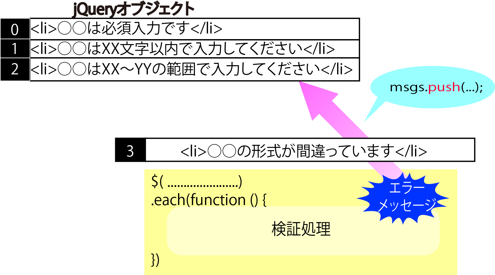

# 入力検証

## 概要

入力フォームに対して(値の正誤を確認する機能)を実装

送信フォームで『空白』が送信された場合、エラー出力をする

それぞれ『空白を許可しない』の条件は同じ

* Javascript
    * フォームに入力がされたタイミングで判定
* jQuery
    * 送信ボタンが押されたタイミングで判定
* PHP
    * 送信ボタンが押されたタイミングで判定
        * ただし、ブラウザのJavascriptが無効になっていることが条件


## 事前知識

* 入力検証(画面側)
    * イベントオブジェクト
    * this
* データの送信
    * 送信の仕組み
    * GETとPOST

### イベントオブジェクト

* イベント処理を表す箇所で引数`e`
    * イベントオブジェクトと呼ばれる
        * イベントが発生した時の様々な情報を含む
        * イベントが発生した時にブラウザから自動的に渡される
        * イベント処理の中ではイベントオブジェクトに自由にアクセス可能
        
```javascript
function(e)
```

### this

* this
    * イベントの発生元を表すのはthisキーワード
        * イベントが発生した要素

```javascript
$('.error_mark', this).remove();
```

### データの送信

* 通信とは
    * Webサーバーとクライアン卜ソフト(Webブラウザなど)間の通信
        * HTTP ヘッダーを使って行われる
    * ブラウザから送信はデータを送信
        * ヘッダ情報(リクエストヘッダー)に格納して送信
        * リクエス卜ヘッダーは、文字列で構成されている
    * サーバはデータを受け取り処理をする
    
### リクエストメソッド GETとPOST

* WebブラウザからWebサーバにデータを送信する方法
    * GET
        * URLのリンクの部分にデータを付加して送信する
            * 例：通販サイトの商品リンク
    * POST
        * 送信ボタンをクリックしてデータを送信する場合
            * 例：お問合せ用フォーム

## 実装

### 事前準備

入力値の検証機能を実装するための準備

* (1)適用する検証の種類はclass属性で定義する
* (2)エラーメッセージを表示するための領域、スタイルを準備する

#### (1)適用する検証の種類はclass属性で定義する

* それぞれの項目に対してどの検証機能を有効にするかは、class属性で設定する
    * 実際に有効にする検証の種類を空白区切で列挙
    
```html
<input type="text" id="family_name" size="20" class="valid required" ...>
```

※class属性は、上記のように要素の役割を分類するためのキー情報としても利用可能

#### (2)エラーメッセージを表示するための領域、スタイルを準備する

* 出力するための領域を確保する
    * 配下の要素は、後から検証処理を実行した時に動的に追加する

```html
<タグ id="出力用のid名"></閉じタグ>
```

##### 検証機能を有効にするには

validというクラスの後ろに、実際に有効にする検証の種類を空白区切で列挙する。

##### 検証に利用できるclass属性の方法

* 検証に必要なパラメータ情報はdata-xxxx属性で定義
    * 目的に応じて開発者が自分で自由な値を設定できる特別な属性
    * xxxxの部分には、小文字の『 a z- _ 』などの文字を利用可能
    
例：
```html
<input type="text" id="title" size="30" class="valid length"
    data-length="30">
```

data-xxxx属性で指定した値は、dataメソッドで「data('xxxx')」のように指定することで取得できる

### 処理の記述

#### 初期化
* フォームの内容を初期化しておく
    * ２回目以降のサブミットではすでにエラーメッセージがページ上に表示されている可能性があるため
    
1. エラーメッセージを格納する配列を初期化

```javascript
msgs = [];
```

2. エラー項目を表す「 * 」を全て削除

```javascript
$('.error_mard', this).remove();
```

3. error_fieldクラス(エラーのあった要素の背景を赤くする)を除去

```javascript
$('.valid',this).removeClass('error_field')
```

#### thisをオブジェクト化

* `this`を`$()関数`で囲んでjQueryオブジェクトに変換
    * valメソッドやprevメソッドのようなjQueryメソッドを呼び出せるようになる

```javascript
/* この例では、thisは<form>要素を表す */
if ($(this).val() === '') { // もしフォームが空だったら
  setError(this,
    $(this).prev('label').text() + 'は必須入力です。');
```
valメソッドはテキストボックスの値を設定/取得する役割

#### 検証機能を実行

1. フィルターメソッドで絞り込む
2. eachメソッドで検証対象の要素を順にチェック
    * eachメソッドはjQueryオブジェクト(要素セット)の内容を順に処理する
    * eachメソッドの中では、thisキーワードで個々の要素にアクセス可能
    
```javascript
$(セレクター).each(function() {
	...要素ここに対する処理...
}
```
* jQueryでは要素セット全てに対して無条件に移行のメソッドを適用する
    * そのため、繰り返し処理を意識することはない
        * 要素を順に取り出して個別に処理を行いたいという場合
            * eachメソッドを使用。

#### エラーリストを表示

* 検証の結果、エラーがあったかどうかをチェック
    * lengthは、配列に含まれる要素の数を表すプロパティ
* 検証エラーがあった場合
    * エラーリストを表示
    * 配列msgsにエラーメッセージをセット
        * 配列msgsが空かどうかで、エラーの有無を判定
            * joinでメッセージを連結
                * 区切り文字のデフォルト値はカンマ(,)
                * プログラマが意図的に空文字列('')を指定する
* エラーが一つもなかった場合
    * エラーリストを非表示

```javascript
if (msgs.length === 0) {
  $('#エラー出力用ID').css('display', 'none');
} else {
  $('#エラー出力用ID')
    .css('display', 'block') // エラーリストを表示
    .html(msgs.join('')); // 連結し、一つの文字列にまとめる
  // イベントデフォルトの動作を取り消しなさい(prevent)という意味です。
  // ここではエラーリストが表示できたらsubmitイベント本来の挙動(フォームの送信)をキャンセル
  e.preventDefault();
```

```javascript
if ($(this).val() === '') {
setError(this, // エラーメッセージをセット
  $(this).prev('label').text() + 'は必須入力です。');
}
```

### 検証本体

* setError
    * 検証エラーが発生した場合にエラーメッセージを配列msgsに格納する関数

```javascript
.filter('.検証名')
.each(function() {
	if (検証を行うための条件式) {
    	setError(this, 検証メッセージ);
    }
})
.end()
```

##### setErrorの中身

* 引数として検証対象の要素elem、エラーメッセージmsgを受け取る
    * 配列msgsに「<li>エラーメッセージ</li>」の形式でセット
    * 検索対象の要素にerror_fieldクラスをセット(背景を赤くする)
    * 検索対象の要素の直後に「 * 」と言うマークを追加する

```javascript
  var msgs;
  var setError = function(elem, msg) {
    msgs.push('<li>' + msg + '</li>'); //① push() 配列の末尾に指定された値を追加していくメソッド
    $(elem)
      .addClass('error_field') //②
      .after('<span class="error_mark">*</span>'); //③
  };
```

##### 必須検証

* 必須検証の条件式は`$(this).val() === ''`
    * thisは、この文脈では検証対象の要素を表す
        * $(this).val()でその入力値を表す
    * 必須検証では、入力値がから文字である場合にエラーとみなす

エラーメッセージは以下で作成

```javascript
$(this).prev('label') //検証要素の直前の<label>要素という意味
```

```javascript
// 項目名をラベルをもとに取り出しメッセージを追加
$(this).prev('label').text() + 'は必須入力です。');
```

## フォームの送信

### フォームを作る

* データをPOSTメソッドで送信するにはHTMLの`form`タグを使用する
    * `method`属性に`post`を設定
    * `action`属性に`送信先ファイル`を指定

```html
<form method="post" action="飛び先ページ">

</form>
```

#### まとめ

* イベント
    * マウスのクリックやキーの押下などのページの中で起こる様々な出来事
* `イベント名(function(){...})`で、イベントに対応した処理を定義
    * 標準で対応していないイベントは、onメソッドで処理
* イベントが発生すると、イベントオブジェクトが自動的に作成される
    * イベント処理(イベントリスナー)に渡される
* イベントバブリング
    * 下の階層で発生したイベントが、順に上の階層に伝播していくこと

