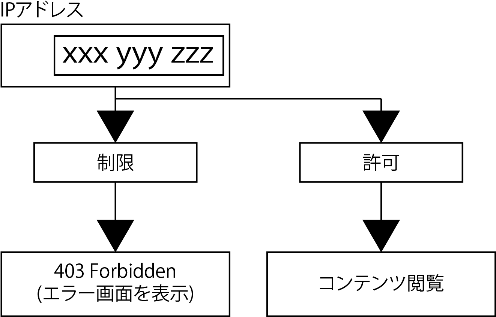

# IPアドレス制限



## 特定のIPアドレスだけ許可する

### `.htaccess`を作成する

* IPアドレスを元に制限・許可を行う方法
* IPアドレスの制限・許可の条件はApache(Webサーバ)を設定するファイルに記述する
* httpd.comでも同様に設定可能
    * ここでは使用頻度の高い`.htaccess`ファイルに設定する
* Apacheを設定した時に`.htaccess`を有効にする
* `.httaccess`ファイルをドキュメントルートに作成する

```text
/var/www/html
```

### Orderディレクティブの追加

* `.htaccess`ファイルを編集する
* Deny,Allowは間にスペースを入れずに入力
    * 拒否: Deny
    * 許可: Allow
* Orderディレクティブは許可される順番を指定するためのもの
    * 今回の例
        * 先: Denyディレクティブ
        * 後: Allowディレクティブ
* ディレクティブとは、Apacheの動作を設定する指示文という意
    * コマンドのようなもの

#### Denyディレクティブの追加

* Denyディレクティブにallを指定することで全ての端末から接続不可になる
* ドキュメントルートに`.htaccess`ファイルを保存
* アクセス用にtest.phpを作成してファイルを`.htaccess`ファイルと同じディレクトリに保存する
* この状態でブラウザから`http://localhost/test.php`にアクセスする
* `Access forbidden!`や`Error 403`などと画面に表示され、アクセスできない
    * もし、記述に誤りがある場合は、`Server error!`や`Error 500`などと表示される

#### Allowディレクティブの追加

* これまでの設定により全てのIPアドレスを拒否して制限した
* 次に、Allowディレクティブで、アクセスを許可するIPアドレスを指定する
* `Allow from`の後に、許可するIPアドレスを入力する

```text
# 特定のIPアドレスを許可
Allow from 許可したいIPアドレス
```

* IPアドレスはIPv4とIPv6の形式がある
* ここではIPIPv4形式の`xxx.xxx.xxx.xxx`(xは数字)を入力する
* 割り振られたIPアドレスにより、Webサイトを閲覧する
    * インターネットにアクセス時はプロバイダーや携帯会社から割り振られている
* Deny行とAllow行を入れ替えても問題ない
    * Orderディレクティブの`Deny,Allow`,`Allow,Deny`に入れ替えると評価の順番が変わる
    * 最後に評価される`Deny from all`により全て拒否される

```text
# Denyを最後に実行するため全て拒否になる
Order Allow,Deny
Deny from all
Allow from 許可したいIPアドレス
```

#### 特定のIPアドレスだけ制限する

* 特定のIPアドレスだけ制限するにはOrderディレクティブでAllow(許可)を先に評価する
* `Allow from all`で先に全てを許可
* その後に拒否するIPアドレスを指定する
* IPアドレスをコードのように連続すると複数のIPアドレスをアクセス拒否に可能
* `from`の後にはIPアドレス以外にドメイン名(xxx.comのような形式)も設定可能

```text
Order Allow,Deny
Allow from all        # ここで全てを許可し
Deny from IP アドレス1 # ここに拒否IPアドレスを箇条書きしていく
Deny from IP アドレス2
Deny from IP アドレス3
```

#### 自分のIPアドレスを知る

* 自分のPCがどのようなIPアドレスでインターネットに接続しているかを知りたい場合
* レンタルサーバなどに下記のファイルを設置して閲覧すると表示される
    * [ipcheck.php](https://github.com/aki-creatist/exam1/blob/master/var/www/html/ip/ipcheck.php)
* 自宅で複数のPCを無線LANなどで接続している場合はLAN内の各PCにIPアドレスが割り振られている
* これらはインターネット上のIPアドレスとは違うもの
* LAN内でIPアドレスによる制限を試す場合は、別のPCからXAMPPを起動しているPCにアクセスする
* LAN内のPCのIPアドレスは、OSごとに表示する画面があるためOSのマニュアルを参照
* ターミナルやコマンドプロンプトからコマンドを実行して確認する場合はOS別に以下のコマンドを実行する

```bash
#Windowsで自分のIPアドレスを知る
ipconfig
#MacとLinuxで自分のIPアドレスを知る
ifconfig
```
