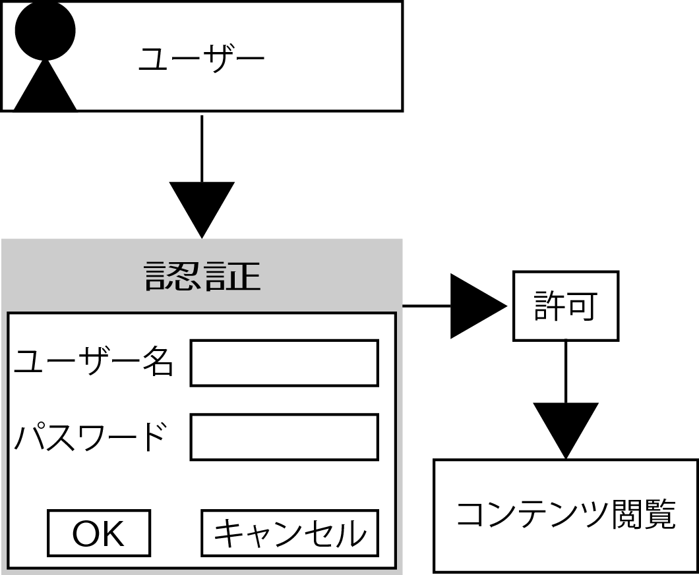

# authorize

## 概要

* 認証と認可の技術を利用して閲覧制限をする
    * 閲覧できる人を予め決める
    * 見せたい人以外は閲覧不可にする

### 認証と認可

認証により本人を確認して、認可によりファイルにアクセス可能

* `認証`: Authentication
    * `本人を確認する`こと
    * ユーザーIDとパスワードを使って本人が正規の利用者であるかどうかを確認する
* `認可`: Authorization
    * 認証されたユーザーがアクセスできるよう権限を制御すること
    * 同様に認証しても認可によりアクセスできるコンテンツを変更可能

## 背景

* ネット上にWebサイトを公開するということ
    * 誰でも閲覧できるということ

## 種類

* Apacheの機能を使って制限
    * [IPアドレスによるアクセス権限](01_ip)
    * [パスワードファイルを利用したBasic認証](02_basic)
* PHPの機能を使って制限
    * [プログラム内部のIDとPWを利用したBasic認証](03_basic2)

## 動作

* http://localhost:8080/auth/01_ip/
* http://localhost:8080/auth/02_basic/
* http://localhost:8080/auth/03_basic2/

## Apacheの機能を使って制限

* Apache(Webサーバ)の機能を使ってアクセスを制限する・許可する方法
* ディレクトリに対して設定する
* IPアドレスによる制限とBasic認証を組み合わせて利用することがある

### IPアドレスによるアクセス権限

* IPアドレスを元にアクセスを許可・制限する方法
    * IP: 端末を判別するための番号
        * ユーザーがWebサーバにアクセス時は、各々のPCやタブレット、スマートフォンをに割り振られている
    * ディレクトリ内をがっちりと守りたいときはIPアドレスによる制限は非常に有効

### パスワードファイルを利用したBasic認証

* HTTPに用意された認証方式であるBasic認証とDigest認証
    * ログイン画面はブラウザにより異なる
        * この画面はプログラマーば変更不可
* あらかじめ設定したユーザIDとパスワードにより本人を特定する

## PHPの機能を使って制限

* PHPとDBを利用した認証機能では、認証情報を全てDBに保存している
* ユーザーがアクセス制限したページを閲覧しようとする
        * その際、セッション機能を使って認証済みかどうかを確認する
        * 認証されていないユーザーだとわかった時点でユーザーはログイン画面に遷移する
            * ログイン画面は、自由に作成可能
                * 通常の画面に組み込むなど
* ここで、登録済みのユーザーはIDとパスワードで本人を確認して認証する
* 認証したユーザーと未登録のユーザーのコンテンツを分けて表示可能

## その他

### Webサービスによる制限(OAuth)

* Webサービス認証と呼ばれる認証方式
    * 例: GoogleやFacebook、twitterなどにすでに登録している場合
    * 登録済みのIDとワスワードを利用して別のサービスの会員になることが可能
* アクセストークンというキーを利用してコンテンツを閲覧可能にする
* PHPにも組み込みのクラスがあり、それを利用可能

