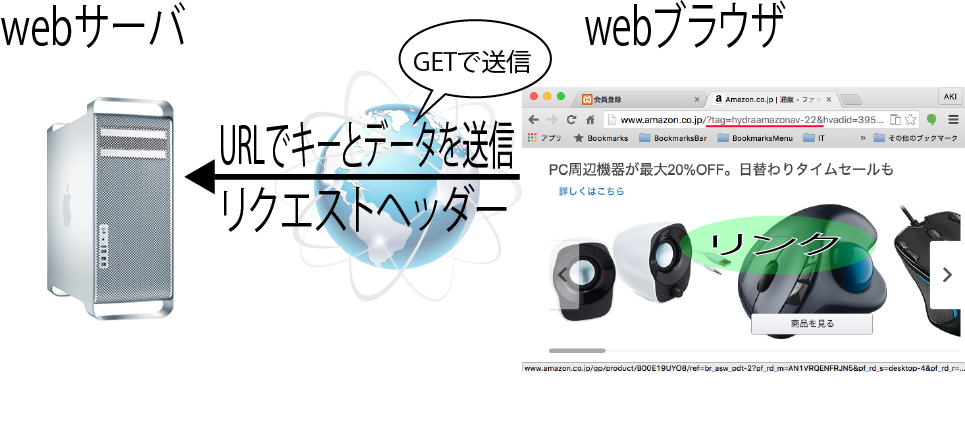

# GETで送信するには



## URLにキーとデータを追加する

* Webページをブラウザから閲覧するときにはリクエストメソッドとして「GET」が送信されてる
* このときURLに決められた形式でデータを付加すると、POSTと同じようにデータをWebサーバーへ送信可能
* POSTのときのようにどこかにメソッドを指定する必要はなく、URLの最後に「?」をつけて、キーとデータの組を「 = 」でつなぐだけ
* 複数のデータを送信する場合は「&」を使ってキーとデータを追加していく
* 送信できるデータの量は、Webサーバーによって違う
    * 容量が大きい場合はPOSTを使用するようにする

```text
URL? キー = データ&キー = データ&キー = データ
http://localhost/view.php?onamae=AKI?gender=male
```

## データの受け取り

* 受信したデータをPHPスクリプト内で参照するには$_GETを使い、`$_GET["onamae"]`、`$_GET["gender"]`などとする