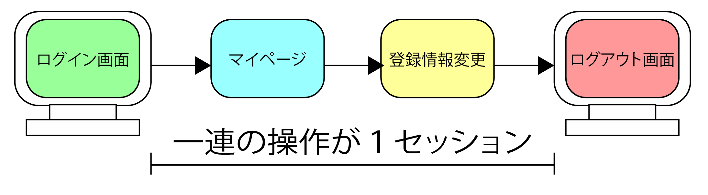
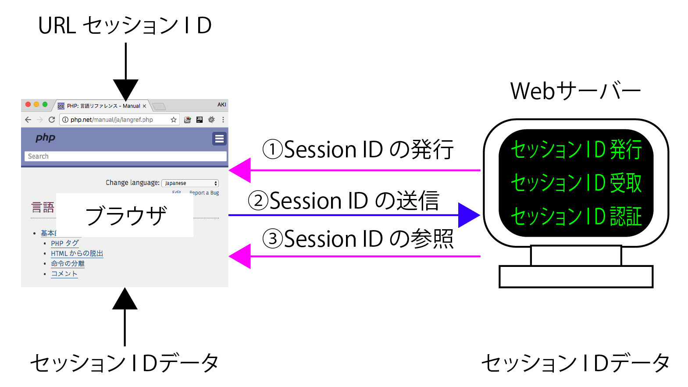

# セッション

## 概要

* Webサイトに対するアクセス数の単位
    * 閲覧者がサイト内で行う一連の操作を1セッションと数える
        * 閲覧したページ数には関係なく、1回の閲覧が1セッション
        * ある程度時間が経った後に次の操作をすると新しいセッションとして数える
* 画面遷移をすると送信データ通常は消失する
* セッションは画面遷移の際に利用するとデータを保持する仕組み
* このセッション機能はクッキーを利用して実現している



## 意義

* 1セッションの間、ページを表示するたびにWebブラウザはWebサーバに接続
    * HTTPプロトコルでリクエストヘッダーとレスポンスヘッダーをやりとり
    * ページが表示されたら切断
        * このように、Webサーバーに接続したままではない
        * 表示中のページから次のページに移動したときに、前のページの情報を参照したり保持したりする必要が出ててくる

### 具体的な用途

* ショッピングサイト
    * 買い物かごや会員ごとに違う内容を表示させたいときなど
    * 同一のユーザーが閲覧していることを確認
        * 情報を複数ページで持ち回る

## 認証の流れ

* ブラウザ - サーバにアクセス
* サーバー - セッションIDを発行する
* ブラウザ - セッションIDをファイルとしてクッキーに保存
* サーバー - セッションデータの検索と内部変数の復活
* ブラウザ - データを参照

### セッションの再開

* 同じクライアントでクッキーを発行したサイトにアクセスする
    * クライアントは、保存したファイルの中からドメイン名とパスが同じクッキーを検索する
* 存在する場合クッキーの内容をサーバに送信する
* サーバは、同じセッションIDのファイルがあれば内部の変数を復活する
* ログイン成功時にセッション変数にログインした証拠を保存しておくと次のアクセスの時に認証した証拠として利用可能

## 仕組み

* 閲覧したユーザーごとに「セッションID」を発行
    * セッションIDはクッキーに保存したり、あるいはURLに付加される
* セッション管理の機能を利用してデータを保存した場合
    * セッションIDごとに保存用のファイルが保存される
        * 場所は`php.ini`の`session.save_path`に設定されたディレクトリ
* ページから別のページへ移動した場合
    * セッションIDをクッキーやURLに付加した文字列から受け取る
    * そのセッションIDを利用して、保存したデータを参照する
* 一定期間アクセスせず、有効期限を過ぎるとセッションが破棄される
    * 再度操作する際、新たなセッションIDが発行される

### 流れの詳細

* `session_start()`を実行するとセッションが開始される
* クライアント(Webブラウザ)からこのPHPプログラムにアクセス
* サーバ(WebサーバとPHP)から`レスポンス`が送信される
* レスポンスの`ヘッダ`部分にセッションIDがクッキーの情報として追加されてブラウザへ送信される
* クライアントはヘッダを解釈してPC内部にクッキーをファイルとして保存する
* この時クッキーファイルを確認すると`PHPSESSID`と対になって`9nrdea17...`のような文字列が保存される
    * はじめのPHPSESSIDはセッション名何も指定しないとこの名称が付く
* 次の文字列はセッションIDランダムな文字列が自動的に発行される合わせて、ドメイン名とパスが保存される

## セッション管理

* スーパーグローバル変数`$_SESSION`に情報を格納する
* セッションIDの発行、取得などは自動的に行われプログラミング時に意識は不要

## 利用する

* `session_start()`
    * セッションを開始する
* `$_SESSION["キー"] = "値";`
    * セッション変数にデータを格納する
* `session_unset();`
    * セッション変数をすべて削除
        * 引数は指定せずに実行
* `session_cache_expire(60);`
    * 有効期限を設定して終了
    * インストールした状態では180分
        * php.iniの`session.cache_expire`に設定されてる
        * 有効期限はsession_cache_expire関数でも分単位で設定可能
* `session_destroy();`
    * 有効期限を待たずにセッションIDおよびデータを破棄する
    
## サンプル

[counter.php](counter.php)

* `session_start`関数でセッションを開始
* `if (isset($_SESSION["count"]))`
    * データが格納されているかどうかチェック
        * データが格納されている場合
            * `$_SESSION["count"]` の内容を$countに格納
            * `$count++` で１だけ加算
            * 加算した`$count`の内容を、`$_SESSION["count"]`に戻す
            * ページをリロードするたびにカウント

[form.html](form.html)

* 関連ファイル
    * [form.html](form.html)
        * フォームの送信
    * [confirm.php](confirm.php)
        * セッションの開始を宣言
        * POSTメソッドで送信されてきたデータを同じキーのセッション変数に格納
            * `$_POST["user_id"]`のみ内容があるかどうか確認
                * form.htmlから移動する場合
                    * `$_POST["user_id"]`が存在する
                * view4.phpkらconfirm4.phpへ移動する場合
                    * `$_POST["user_id"]`が存在しない
                        * `存在しないものを格納している`というエラーが発生する
    * [view.php](view.php)
        * `[確　認]`か`[戻　る]`の、どちらがクリックされたかを判断して処理
            * はじめにセッションの開始を宣言
        * `$_POST["キー"]`から`$_SESSION["キー"]`に変更
        * `print_r($_SESSION);`で内容を表示
            * セッション変数の状況を確認
        
## セッションの仕組み



## セッションを管理する

### session_start関数

```php
//セッションを開始する
session_start();
```

### セッション変数の操作

* セッション変数から指定した「キー」の登録を削除したいときは`session_unregister`関数にキーを指定して使用する

```php
//セッション変数にデータを格納する
$_SESSION["キー"] = "値";
```

```php
//セッション変数のキーの登録を削除する
session_unregister("キー");
```

### セッションの終了

```php
session_unset();	// セッション変数をすべて削除します

session_cache_expire(60); // 有効期限を設定します

session_destroy(); // セッションを破棄します
```

### SID

* SIDはセッションに関係する特別な`定数`
* SIDには「セッション名 = セッションID」のような形式でデータが格納されていて、下記のコードのようにして、セッションIDをURLに付加可能

```php
<a href="page2.php?<?＝'SID'?>">Next Page</a>
```

* この機能を有効にするにはphp.iniの中のsession.use_trans_sidを「On」に設定する
